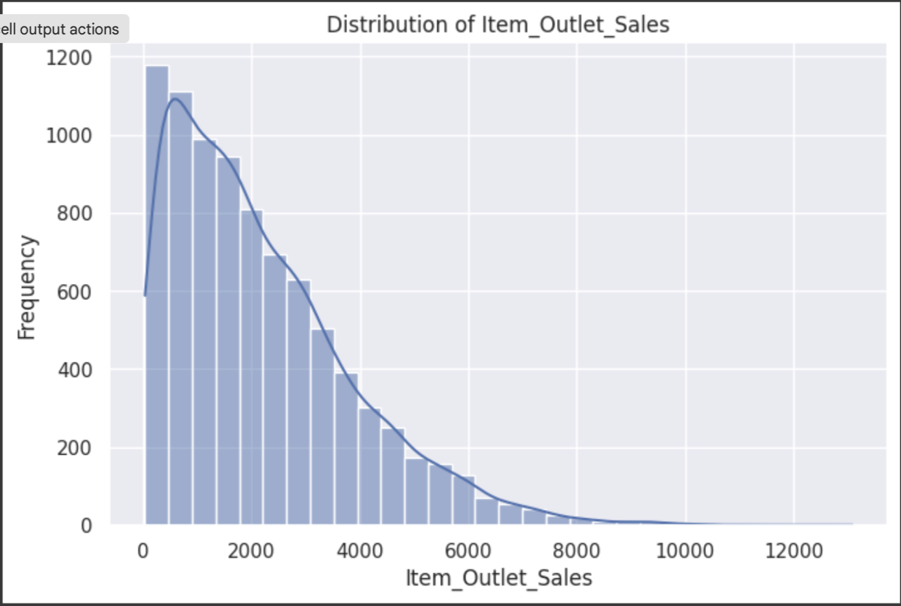
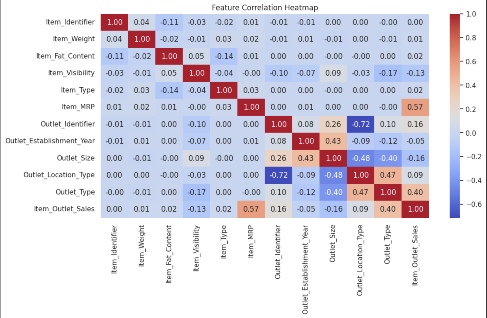
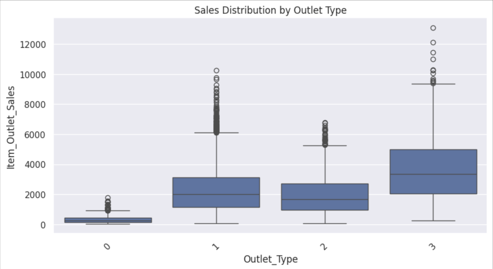
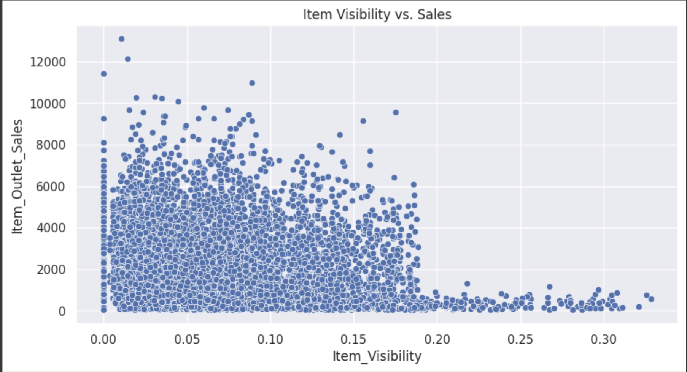
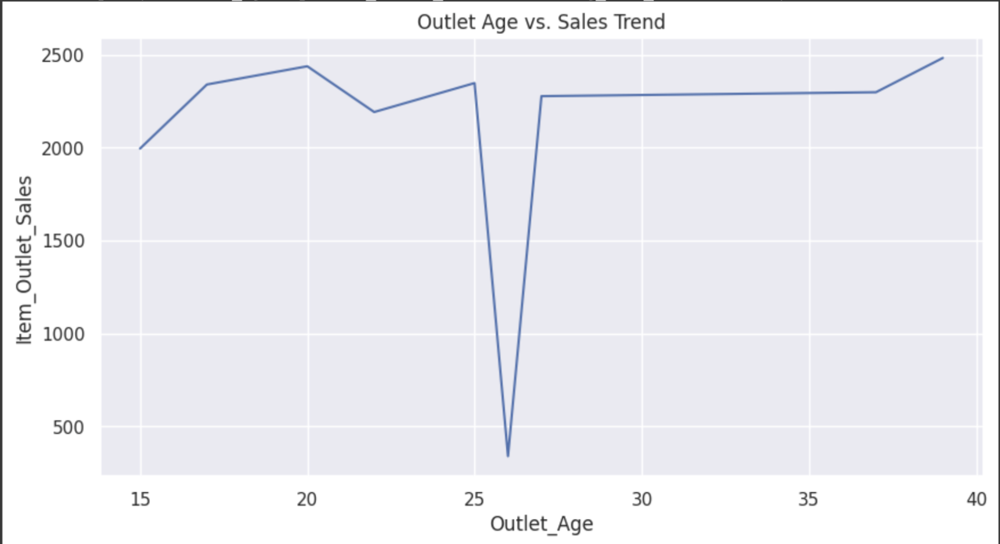
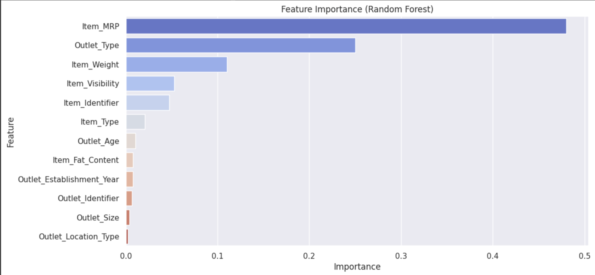

# Future Sales Prediction and Regression Analysis

## Project Overview
This project focuses on analyzing future sales data and building regression models to predict sales based on various product and outlet features. The dataset contains information such as item weight, item visibility, outlet type, and other attributes that influence sales performance.

The goal is to understand feature importance and optimize predictive performance using different regression techniques, including Random Forest and Gradient Boosting.

## Dataset Description
The dataset consists of:
- **Item Attributes:** Item weight, item visibility, item type, item MRP, etc.
- **Outlet Attributes:** Outlet type, outlet establishment year, outlet location type, outlet size, etc.
- **Target Variable:** Item outlet sales

## Exploratory Data Analysis (EDA)
Key steps in EDA include:
1. **Handling Missing Values:** Missing values in `Outlet_Size` and `Item_Weight` were addressed.
2. **Feature Engineering:** Some categorical variables were converted into numerical values.
3. **Feature Importance Analysis:** Identified the most influential features using Random Forest.
4. **Visualization and Analysis:** Created bar charts and distribution plots to understand data trends.
   

Sales Distribution: Sales are right-skewed, with most items having low sales and a few high-value outliers.


Correlation Analysis: Item_MRP strongly correlates with sales, while item visibility and outlet establishment year have minimal impact.


Sales Trends (By Outlet Type): Supermarket Type 3 has the highest sales, while grocery stores lag behind.


Sales Trends (By Item Visibility): Low-visibility items still sell well, indicating that visibility may not be a strong predictor.


Mid-aged outlets (10-20 years old) perform best, while very old outlets show declining sales.

## Regression Models Used
We experimented with multiple regression techniques:

### 1. **Random Forest Regressor**
- Used 500 estimators, `max_depth=10`, `max_features='log2'`, `min_samples_leaf=4`, and `min_samples_split=2`.
- Feature importance analysis indicated that `Item_MRP`, `Outlet_Type`, and `Item_Weight` were the most influential variables.
  

- Achieved an **R² score of 0.6138** on the test set after hyperparameter tuning.

### 2. **Gradient Boosting Regressor**
- Configured with `n_estimators=300`, `learning_rate=0.05`, and `max_depth=5`.
- Addressed missing values before fitting the model.
- Performed similarly to Random Forest, with an **R² score of 0.5867** on the test set.

## Optimization & Hyperparameter Tuning
- GridSearchCV was applied to Random Forest to optimize hyperparameters, leading to improved performance.
- Features like `Outlet_Establishment_Year`, `Outlet_Identifier`, `Outlet_Size`, and `Outlet_Location_Type` were removed as they had minimal impact on prediction.
- Further improvement could involve feature transformation, polynomial regression, or deep learning models.

## Installation & Setup
To run the analysis and models:
```bash
pip install -r requirements.txt
python futruesales_analysis_and_regression_models_.py
```

## File Structure
```
- futruesales_analysis_and_regression_models_.py  # Main script for training and evaluation
- dataset.csv  # Dataset file (if applicable)
- README.md  # Project documentation
```

## Author
👩‍💻 **K. Harshitha Reddy**  
📧 harshithareddyk2002@gmail.com 
Feel free to contribute or suggest improvements!

## License
This project is licensed under the MIT License.

